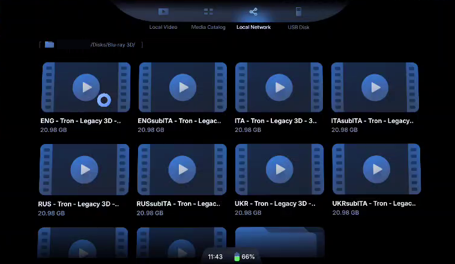
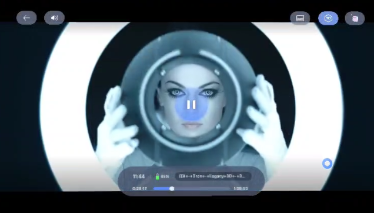

[🇬🇧 English](README.md) | 🇮🇹 Italiano

# Blu-ray e DVD su ogni schermo di casa, 3D compreso, da Linux
#### _Metti un disco nel lettore del PC Linux e guardalo su qualunque dispositivo di casa: TV, tablet, telefono, occhiali XR. Il PC legge, decifra e decodifica il disco al volo e lo serve in rete locale come un normale file video. I Blu-ray 3D diventano 3D affiancato vero per gli occhiali XR (VITURE & co.). Niente rip, niente conversione, niente spazio su disco._

***Nota:*** _Provato con VITURE Pro XR + VITURE Pro Neckband e il suo **3D Player** ufficiale, e con VLC su un visore Pico. Qualsiasi player capace di aprire video da una cartella di rete (SMB), come VLC o Kodi, dovrebbe funzionare allo stesso modo; per il 3D deve anche mostrare il video affiancato. I dischi provati finora sono in [Limiti](#limiti)._



---

## Il problema

Un Blu-ray 3D non contiene due video affiancati. Il 3D è registrato in **MVC** (H.264 _Multiview Video Coding_): un normale video 2D per l'occhio sinistro più una "vista dipendente" con le differenze per l'occhio destro.

- Gli occhiali XR, e quasi tutti i player 3D, vogliono l'**SBS**, _side-by-side_: i due occhi affiancati nello stesso fotogramma.
- In pratica **l'MVC non lo decodifica quasi nessuno**, a parte i lettori Blu-ray dedicati. Android e i suoi player non ci riescono, e FFmpeg scarta in silenzio la vista dipendente: il risultato è 2D.
- La soluzione solita è **copiare e convertire** ogni film in SBS: ore di lavoro e 10-20 GB per film.

## L'idea

Il PC legge il disco e decodifica l'MVC **mentre guardi**, e manda il risultato agli occhiali come se fosse un normalissimo file SBS.

```
Blu-ray 3D nel lettore (oppure un ISO / una cartella BDMV / un rip MKV)
        │  libbluray + libaacs: lettura e decifratura al volo
        ▼
   vista base + dipendente ─► edge264 (MVC → SBS 3840×1080) ─► encoder (NVENC o x264) + audio
        │
        ▼
   "ITA - film - 3D SBS.ts"  file virtuale in una cartella condivisa SMB (su disco non esiste)
        │   Wi-Fi
        ▼
   Occhiali: 3D Player ► Rete locale ► Disks ► film   → 3D automatico, pausa, seek
```

- **Inserisci il disco, compare il film.** Circa 15 secondi dopo la chiusura dello sportello il file compare nella cartella condivisa, con il nome del disco; togli il disco e sparisce.
- **Blu-ray 3D, Blu-ray 2D e DVD.** Stesso funzionamento per tutti: i dischi 3D finiscono nella cartella `Blu-ray 3D/`, i Blu-ray 2D in `Blu-ray/`, i DVD in `DVD/`.
- **Qualunque dispositivo di casa.** Una TV, un tablet o un telefono con un player che apre le cartelle di rete riproduce Blu-ray e DVD; per i file 3D serve un player che mostri il 3D affiancato (occhiali XR, visori VR). Più dispositivi possono guardare insieme, anche lo stesso disco in due lingue.
- **Non si scrive niente su disco.** Il file `.ts` risulta di circa 22 GB ma non occupa spazio: ogni pezzo viene prodotto nel momento in cui il player lo legge.
- **Il seek funziona.** Il file ha bitrate costante, quindi ogni byte corrisponde a un secondo preciso del film. Quando il player salta, il PC riprende a leggere il disco da lì (qualche secondo: il lettore ottico deve riposizionarsi).
- **I player vedono un file normale.** Niente app particolari, server o protocolli di streaming: interfaccia, pausa, seek e riconoscimento del 3D sono quelli del player.

Tutte le procedure descritte sono un compromesso ragionato tra il "manuale" e il guidato. È uno dei modi possibili per farlo.

## Requisiti

#### Hardware
- **Un lettore Blu-ray** nel PC Linux (interno o USB), che legge anche i DVD. Di solito si chiama `/dev/sr0`; se ce n'è più di uno, `lsblk -d -o NAME,MODEL | grep sr` dice qual è quale.
- **Un PC Linux** sulla stessa rete degli occhiali. Decodificare l'MVC è lavoro per la CPU: basta una CPU desktop recente con più core (sul PC di prova la decodifica va a circa 9 volte il tempo reale). CPU a basso consumo non sono state provate.
- **Facoltativa: una GPU NVIDIA**, per codificare con NVENC. Senza, il video viene codificato dalla CPU con x264 (sulla stessa CPU comunque circa 6 volte il tempo reale).
- **Occhiali XR + un player** che apra video da una cartella di rete SMB e riproduca il 3D SBS. Provato: VITURE Pro XR + Pro Neckband, 3D Player ufficiale.
- **RAM**: circa 0,5 GB liberi mentre guardi un film. Su disco non si scrive nulla: la pipeline prepara in memoria fino a circa 256 MB in anticipo sul player e ne tiene circa 190 già letti per i piccoli salti indietro, più 16 MB (inizio e fine) per ogni file aperto.
- **Un buon Wi-Fi** (consigliati i 5 GHz): 15 Mbit/s per il 2D, 24 Mbit/s per il 3D, meno con le copie in `Light/` (vedi [Rete e qualità](OPTIONS.it.md#rete-e-qualità)).

#### Decifratura: le chiavi le porti tu
I Blu-ray commerciali sono cifrati (AACS, alcuni anche BD+). Il progetto **non fornisce e non scarica chiavi**; usa quello che hai, in quest'ordine:
1. **libaacs + `KEYDB.cfg`**: tutto open source. Metti un database di chiavi in `~/.config/aacs/KEYDB.cfg` (con Docker: nella cartella indicata come `AACS_DIR`).
2. **MakeMKV**, se installato e registrato: la sua libreria `libmmbd` decifra al posto di libaacs (anche il BD+).
3. Gli **ISO / le cartelle BDMV non cifrati** non richiedono chiavi.

I DVD (CSS) vengono decifrati da **libdvdcss**, che installi tu: su Debian/Ubuntu `sudo apt install libdvd-pkg && sudo dpkg-reconfigure libdvd-pkg` (Debian: sezione `contrib`). Non è nell'immagine Docker; in `docker-compose.yml` c'è una riga commentata per usare quella del sistema.

> ⚖️ In molti paesi (Italia e gran parte dell'UE compresi) aggirare una protezione anticopia non è consentito, nemmeno per una copia privata. Verifica le regole del tuo paese.

#### Software sul PC
- **Docker** (strada A) _oppure_ un sistema **Debian/Ubuntu** (strada B). Tutto il resto lo installa il progetto:
  - [edge264-mvc](https://github.com/jens-duttke/edge264-mvc): l'unico decoder open source della vista dipendente MVC;
  - libbluray, libaacs, libbdplus (Blu-ray), libdvdread (DVD), FFmpeg, Samba (la cartella di rete), FUSE + pyfuse3 (il file virtuale).

---

## Passo 1 — Installazione: scegli la strada

| | **A. Docker** | **B. Script nativo** |
|---|---|---|
| Per chi | usa già Docker | Debian / Ubuntu |
| Tocca il sistema | no: Samba, FUSE e librerie stanno nel container | sì: pacchetti, `/opt`, `smb.conf`, `fuse.conf` (`uninstall.sh` toglie quello che ha aggiunto) |
| Decifratura | libaacs + il tuo KEYDB (MakeMKV non è nell'immagine) | libaacs + KEYDB, oppure MakeMKV se installato |
| Codifica NVIDIA | serve il NVIDIA Container Toolkit | funziona subito |
| Samba già installato sul PC | conflitto sulla porta 445: va fermato | la condivisione si aggiunge alle tue |

Per prima cosa scarica il progetto:
```console
git clone https://github.com/suppressio/bluray3d-xr-glasses-linux.git
cd bluray3d-xr-glasses-linux
```

### Strada A — Docker

- [ ] Crea le impostazioni:
```console
cp .env.example .env
```
- [ ] Modifica `.env`:
  - `DRIVE=/dev/sr0` per tenere d'occhio il lettore Blu-ray; in `docker-compose.yml` togli il commento alla riga `- /dev/sr0` sotto `devices`;
  - `AACS_DIR` = la cartella che contiene il tuo `KEYDB.cfg`;
  - `MOVIES_DIR` = una cartella con ISO, cartelle BDMV o rip MKV (può essere vuota se usi solo il lettore);
  - `AUDIO_LANG` e `SUBS` = le lingue audio e dei sottotitoli che vuoi, per esempio `ita,eng` (il resto: [OPTIONS.it.md](OPTIONS.it.md)).
- [ ] Costruisci e avvia. La prima volta ci vuole qualche minuto, perché compila edge264 per la tua CPU:
```console
docker compose up -d --build
```
- [ ] Inserisci un disco (Blu-ray 3D o 2D, DVD) e guarda il log:
```console
docker compose logs -f
```
```
watching /dev/sr0: insert a Blu-ray
/dev/sr0: disc inserted, opening it
+ Blu-ray 3D/ITA - Tron - Legacy 3D - 3D SBS.ts  (125 min, 24.0 Mbit/s, audio 0x1102 ita dts)
```

Per fermarlo: `docker compose down`. Aggiornare e disinstallare: [più sotto](#aggiornare-e-disinstallare).

##### GPU NVIDIA (facoltativo)
Installa il [NVIDIA Container Toolkit](https://docs.nvidia.com/datacenter/cloud-native/container-toolkit/latest/install-guide.html), poi avvia con entrambi i file compose:
```console
docker compose -f docker-compose.yml -f docker-compose.nvidia.yml up -d --build
```
Nel log deve comparire `video encoder: nvenc`.
> ⚠️ Questa variante non l'ho ancora provata (sul mio PC non c'è il Container Toolkit). NVENC è provato con la strada nativa.

##### 💩 happens: porta 445 già occupata
Se sul PC gira già Samba, il container non può prendere la porta 445. I player di telefoni e occhiali di solito parlano solo con la 445. Quindi mentre guardi il film ferma il Samba del sistema (`sudo systemctl stop smbd`), oppure usa la strada B, che aggiunge una condivisione al Samba che hai già.

### Strada B — Script nativo (Debian / Ubuntu)

- [ ] Lancia l'installazione come utente normale (chiede `sudo` quando serve):
```console
./scripts/install.sh
```
Installa i pacchetti, compila edge264, installa il comando `bluray3d-xr` e aggiunge a Samba la condivisione `[Disks]`, in sola lettura e ad accesso ospite. L'intestazione di [`scripts/install.sh`](scripts/install.sh) elenca tutte le modifiche che fa.

- [ ] Se `ufw` è attivo, lo script stampa il comando per aprire la condivisione alla tua rete locale, per esempio:
```console
sudo ufw allow from 192.168.1.0/24 to any port 445 proto tcp
```
- [ ] Il tuo utente deve poter leggere il lettore (su Debian/Ubuntu: il gruppo `cdrom`, di solito già assegnato agli utenti desktop).
- [ ] Avvialo quando vuoi guardare qualcosa:
```console
bluray3d-xr --audio-lang ita,eng --subs ita,eng /dev/sr0
```
Quando inserisci un disco compaiono i suoi file; ogni riga `pipeline from` è il player che parte o salta:
```
11:23:59 bluray3d-xr v1.0.0
11:24:00 video encoder: nvenc
11:24:00 watching /dev/sr0: insert a Blu-ray
11:24:00 mounted on /srv/bd3d — Ctrl+C to unmount
11:24:00 /dev/sr0: disc inserted, opening it
11:24:00 + Blu-ray 3D/ITA - Tron - Legacy 3D - 3D SBS.ts  (125 min, 24.0 Mbit/s, audio 0x1102 ita dts, forced subtitles ita)
11:24:00 + Blu-ray 3D/ITAsubITA - Tron - Legacy 3D - 3D SBS.ts  (125 min, 24.0 Mbit/s, audio 0x1102 ita dts, subtitles ita)
11:24:00 + Blu-ray 3D/ENG - Tron - Legacy 3D - 3D SBS.ts  (125 min, 24.0 Mbit/s, audio 0x1100 eng dts-hd ma, forced subtitles eng)
...
11:30:24 Blu-ray 3D/Light/ITA - Tron - Legacy 3D - 3D SBS.ts: pipeline from 0.0s (requested 0.0s, offset 0)
11:30:35 Blu-ray 3D/Light/ITA - Tron - Legacy 3D - 3D SBS.ts: pipeline from 1634.8s (requested 1635.3s, offset 2043548532)
```
Si ferma con `Ctrl+C`. Aggiornare e disinstallare: [più sotto](#aggiornare-e-disinstallare).

Lo script è provato con lettore e disco veri in container puliti Debian 13 (trixie) e Ubuntu 24.04; il programma gira ogni giorno su Debian testing.

### Aggiornare e disinstallare

**Aggiornare**, quando esce una versione nuova (vedi [Releases](https://github.com/suppressio/bluray3d-xr-glasses-linux/releases)); `bluray3d-xr --version` dice quale hai:
- strada nativa: `./scripts/update.sh` nella cartella del progetto. Scarica l'ultima versione e copia il programma in `/opt/bluray3d-xr`; ripete tutto `install.sh` solo quando serve (è cambiato edge264, o non c'è nulla di installato). Alla fine scrive "Updated from vX to vY" e l'elenco delle modifiche. Se il programma è acceso, fermalo e riavvialo.
- Docker: `git pull && docker compose up -d --build`.

**Disinstallare**:
- strada nativa: `./scripts/uninstall.sh`. Smonta e cancella `/srv/bd3d`, toglie la condivisione `[Disks]` da `smb.conf` (solo il blocco che aveva aggiunto: le tue condivisioni restano), `/opt/bluray3d-xr` e il comando `bluray3d-xr`. Restano i pacchetti apt (FFmpeg, Samba, libbluray...) e la riga `user_allow_other` in `/etc/fuse.conf`, perché possono servire ad altro: se non servono, toglili con apt.
- Docker: `docker compose down --rmi all` ferma il container e cancella la sua immagine.

Poi cancella la cartella del progetto.

---

## Passo 2 — Guardarlo sugli occhiali

##### Dal Neckband VITURE:
- [ ] Apri il **3D Player**, vai nella scheda **Rete locale** e aggiungi il PC: il suo indirizzo IP (sul PC lo trovi con `hostname -I`), accesso ospite / anonimo.
- [ ] Inserisci il disco nel PC e aspetta circa 15 secondi.
- [ ] Apri la cartella **Disks** (se sembra vuota, torna indietro e rientra). I dischi 3D sono in `Blu-ray 3D/` come `ITA - <film> - 3D SBS.ts`, quelli normali in `Blu-ray/` come `ITA - <film>.ts`: un file per ogni lingua audio, più le versioni con i sottotitoli (`ITAsubENG - ...`: audio italiano, sottotitoli inglesi). In `Light/` ci sono gli stessi film a un bitrate più basso, per il Wi-Fi debole.

```
Disks/
├── Blu-ray 3D/
│   ├── ITA - Tron - Legacy 3D - 3D SBS.ts
│   ├── ITAsubENG - Tron - Legacy 3D - 3D SBS.ts
│   ├── ENG - Tron - Legacy 3D - 3D SBS.ts
│   └── Light/ ...
├── Blu-ray/
│   ├── ITA - Ready Player One.ts
│   └── Light/ ...
└── DVD/
    ├── ITA - Back To The Future.ts
    └── Light/ ...
```
- [ ] Aprilo. Il player riconosce il formato affiancato e passa in 3D da solo. 🎉



La prima apertura e ogni salto con la barra richiedono qualche secondo: è il lettore che si sposta nel nuovo punto.


##### Altri occhiali e altri player
Qualsiasi cosa apra video da una cartella SMB e mostri il 3D SBS dovrebbe andare. Qualche nota dalle mie prove sul Neckband:
- **VLC** lo riproduce, ma bisogna uscire dall'interfaccia SpaceWalker e passare alla modalità Android, avviare il video e _solo dopo_ mettere gli occhiali in modalità 3D. Funziona ma è scomodo, e a volte gli occhiali sono rimasti bloccati in modalità 3D (ho dovuto staccare il cavo).
- **XPlayer2** sul mio Neckband non ha funzionato, con nessun video.
- Il **3D Player non apre un rip MKV di un Blu-ray 3D**: non parte proprio.

---

## Lingue, sottotitoli, qualità

Le impostazioni predefinite offrono tutto quello che c'è sul disco. Di solito si vogliono solo le proprie lingue:
```console
bluray3d-xr --audio-lang ita,eng --subs ita,eng /dev/sr0
```
(Docker: `AUDIO_LANG=ita,eng` e `SUBS=ita,eng` nel file `.env`.) Tutte le altre opzioni, e file ISO, cartelle BDMV/VIDEO_TS o rip MKV al posto del lettore: [**OPTIONS.it.md**](OPTIONS.it.md).

---

## Risoluzione dei problemi

- **Il film non compare e il log dice `cannot decrypt`**: nessuna chiave funzionante per quel disco. Aggiorna il `KEYDB.cfg`, oppure installa e registra MakeMKV (strada nativa).
- **Chiudendo il programma mentre guardi, l'immagine resta ferma una ventina di secondi**: è il player che aspetta prima di arrendersi, perché il file è sparito (il programma si ferma in un secondo). Ferma prima il video sugli occhiali, poi il programma.
- **La riproduzione si ferma ogni pochi secondi**: il Wi-Fi è troppo lento per quel file: aprilo da `Light/`, altro in [Rete e qualità](OPTIONS.it.md#rete-e-qualità).
- **Inserendo il disco non succede niente**: verifica che il lettore sia davvero `/dev/sr0` (`lsblk -d -o NAME,MODEL | grep sr`), che il tuo utente possa leggerlo (`ls -l /dev/sr0`, gruppo `cdrom`) e, con Docker, che il dispositivo sia passato al container.
- **Gli occhiali non vedono la cartella condivisa**: verifica che PC e occhiali siano sulla stessa rete, e controlla il firewall (porta 445/TCP). Da un altro PC Linux: `smbclient -N -L //<ip-del-pc>`.
- **L'immagine va a scatti**: controlla prima il Wi-Fi (5 GHz, vicino al router). Poi il log dell'ultima pipeline (`/tmp/bd3d-pipeline.log`, oppure `docker compose logs`).
- **Un file nuovo in `MOVIES_DIR` non compare**: le cartelle vengono lette all'avvio. Riavvia il programma o il container (i lettori invece sono controllati di continuo).
- **Dopo un salto l'immagine resta ferma qualche secondo**: è il lettore che si sposta nel nuovo punto. In [OPTIONS.it.md](OPTIONS.it.md#animazione-di-caricamento-dopo-un-salto) c'è un'animazione di caricamento facoltativa, con quello che costa.

Per segnalare un problema: indica la versione (`bluray3d-xr --version`; con Docker la prima riga di `docker compose logs`) e il log del programma di quel momento.

---

## Come funziona

- **Lettura del disco.** libbluray legge il disco (o l'ISO/BDMV) e lo decifra tramite libaacs o la libmmbd di MakeMKV (`src/bluray.py`, un piccolo binding ctypes). Il film è la playlist più lunga le cui clip hanno tutte una vista dipendente MVC (`src/bdmv.py` legge playlist e informazioni delle clip).
- **Le due viste.** Il file `.ssif` di una clip 3D alterna la vista base (PID 0x1011) e quella dipendente (0x1012) a blocchi (extent). `src/ssif_demux.py` accoppia i due pacchetti PES di ogni fotogramma in base al DTS e li scrive in Annex B per edge264. Toglie le unità NAL di separazione, di riempimento e di fine sequenza dei Blu-ray, come fa MakeMKV. Le libbluray più vecchie della 1.4 non aprono i file `.ssif`, quindi gli stessi byte vengono ricostruiti dai due file `.m2ts`.
- **edge264-mvc** decodifica entrambe le viste e le scrive affiancate (`edge264_test -Ok`). FFmpeg da solo non ci riesce: scarta la vista dipendente.
- **Seek.** Un tempo viene tradotto in un byte del `.ssif` attraverso l'EP_map (le posizioni dei fotogrammi chiave) e la tabella degli extent della clip. I film composti da più clip (Tron: due) vengono letti in sequenza, e i timestamp audio delle clip successive vengono riportati su un'unica linea temporale.
- **Audio.** `src/disc_reader.py` legge il disco una volta sola: il video va a edge264, la traccia audio scelta (con la lingua presa dalla playlist) va a FFmpeg attraverso una FIFO, ognuno con il suo thread. Il fotogramma chiave viaggia insieme all'audio come ancora temporale, così audio e video partono esattamente insieme. Scarto misurato rispetto alla strada MKV: 4 ms.
- **Il file virtuale.** L'encoder lavora a **bitrate costante** e il muxer MPEG-TS riempie esattamente fino a 24 Mbit/s, così il byte _X_ è il secondo _X_ / 3.000.000 del film. Un file system **FUSE** (`src/bd3d_fs.py`) serve i file. Riavvia la decodifica quando il player salta e mette in pausa la pipeline se va troppo avanti. Per ogni lettore gira una sola pipeline alla volta, perché due farebbero saltare avanti e indietro il lettore ottico. La fine del file, che i player leggono per ricavare la durata, è sintetica: nero e silenzio con i timestamp giusti, così il lettore non viene mandato alla fine del disco.
- **DVD.** `src/dvd.py` legge il disco tramite libdvdread (libdvdcss per il CSS) e i suoi file IFO: il titolo principale (il più lungo), le sue celle, le lingue audio, lo standard video e il formato. Il seek usa la mappa dei tempi per arrivare entro pochi secondi, poi il pacchetto di navigazione di ogni blocco VOBU (circa 0,5 s), che contiene il suo tempo esatto: il punto di ripartenza è noto con precisione. Il lettore DVD di FFmpeg salta solo in modo approssimativo (secondi di scarto, senza sapere dove è atterrato). `src/dvd_reader.py` manda il titolo da lì a FFmpeg, che lo deinterlaccia e lo porta a pixel quadrati.
- **Lettori.** Ogni pochi secondi si chiede al lettore se c'è un disco (senza leggerlo). All'inserimento il disco viene aperto come Blu-ray, altrimenti come DVD, e il suo film aggiunto; all'espulsione viene tolto.

## Sviluppo

- `scripts/check.sh` esegue quello che GitHub esegue a ogni push: ruff, pyright (modalità stretta), shellcheck e gli unit test. Non serve un disco: i test si costruiscono da soli file MPLS, CLPI, IFO e flussi TS. Al primo avvio crea `.venv` con gli strumenti alle versioni fissate (`requirements-dev.txt`).
- `scripts/check.sh --integration` prova anche il disco nel lettore (`BD3D_TEST_DRIVE`, predefinito `/dev/sr0`) o un MKV 3D (`BD3D_TEST_MKV=...`). La prima volta registra un riferimento per ogni disco (solo impronte, in `~/.cache/bluray3d-xr/`); le volte successive il risultato deve coincidere byte per byte.
- VS Code: apri la cartella e scegli `.venv` come interprete. `.vscode/` spegne Pylint: i controlli sono quelli di `pyproject.toml`.

---

## Limiti

- Gli ultimi 2,7 secondi circa di ogni film (dopo i titoli di coda) sono neri: la fine del file è sintetica.
- Dischi provati: uno per tipo (3D: Tron: Legacy; 2D: Ready Player One; DVD: Ritorno al futuro, PAL). Solo AACS: i dischi con BD+ (tramite MakeMKV), quelli con strutture insolite e i DVD NTSC non sono provati.
- I sottotitoli del disco sono disegnati nell'immagine (una versione per lingua), non si scelgono dal player; la profondità 3D è fissa, non presa dal disco. L'audio è convertito in AAC stereo.

## E Windows?

Questo progetto è solo per Linux. Su Windows puoi guardare [**SyLC**](https://github.com/5ymph0en1x/SyLC), un player open source che riproduce direttamente l'MVC dei Blu-ray 3D (MKV, ISO, BDMV) e può produrre SBS. Non l'ho provato.

## Licenza

[MIT](LICENSE). Riguarda solo il codice di questo progetto: edge264, libbluray, libaacs, FFmpeg, Samba e gli altri strumenti che usa mantengono le proprie licenze, e vengono scaricati o installati dalle loro fonti, non distribuiti qui.

## Riconoscimenti e riferimenti

- [edge264-mvc](https://github.com/jens-duttke/edge264-mvc) (BSD), fork di [edge264](https://github.com/tvlabs/edge264): il decoder MVC che rende possibile tutto questo;
- [libbluray / libaacs](https://www.videolan.org/developers/libbluray.html), [FFmpeg](https://ffmpeg.org/), [Samba](https://www.samba.org/), [pyfuse3](https://github.com/libfuse/pyfuse3), [MakeMKV](https://www.makemkv.com/);
- [Play 3D Blu-ray in SBS directly from the disc…](https://cybereality.com/play-3d-blu-ray-in-sbs-directly-from-the-disc-for-playback-on-3d-monitors-xr-glasses-and-vr-headsets-using-free-and-open-source-tools/) (cybereality): un approccio per Windows (LAV Filters + madVR).
