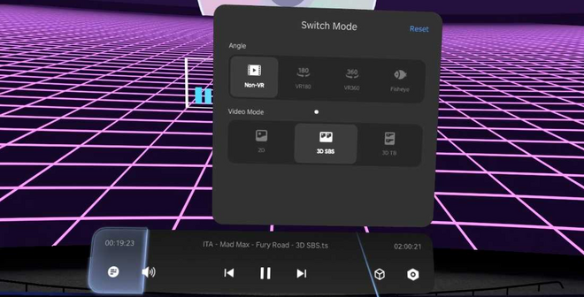
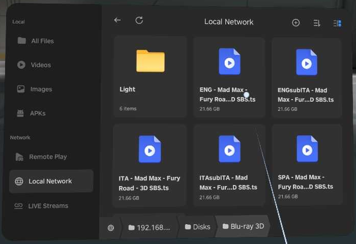
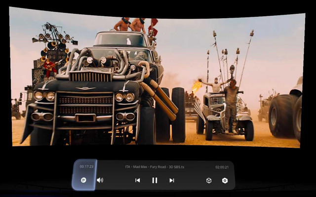

🇬🇧 English | [🇮🇹 Italiano](TESTED.it.md)

# Tested: devices, players, discs

What this project has been tried with so far, and how it went. The [README](README.md) covers the general steps; here are the details for each device and player, and the discs used in the tests. More reports are welcome.

- [Devices and players](#devices-and-players)
  - [VITURE Pro XR + Pro Neckband: official 3D Player](#viture-pro-xr--pro-neckband-official-3d-player)
  - [PICO 4: built-in File Manager and video player](#pico-4-built-in-file-manager-and-video-player)
  - [Other players](#other-players)
- [Discs](#discs)
- [On the PC](#on-the-pc)

---

## Devices and players

### VITURE Pro XR + Pro Neckband: official 3D Player

✅ **Works, 3D included.** The player the project was first built for.

- [ ] Open the **3D Player**, go to the **Local network** tab and add the PC: its IP address (`hostname -I` on the PC tells you), guest / anonymous access.
- [ ] Open **Disks**, then the folder and the movie (go back and in again if a folder looks empty).
- [ ] The player recognizes the side-by-side format and switches to 3D by itself. 🎉

Good to know:
- It has **no audio track menu** and picks a track on its own: that is why each language is its own file by default ([Audio languages](OPTIONS.md#audio-languages)).
- It loads **external subtitle files** next to the video and draws them correctly in both eyes.
- It cuts long file names: that is why the language comes first in the name.
- It opens only files from an SMB share, not network streams.
- It **cannot open a 3D Blu-ray MKV rip** (MVC) at all: it does not start. The virtual SBS file is really needed here.
- Closing the program while a movie plays freezes the player for about 20 seconds (see [Troubleshooting](README.md#troubleshooting)).

### PICO 4: built-in File Manager and video player

✅ **Works, 3D included, with no extra app.** The headset's own File Manager opens network shares, and its video player plays side-by-side 3D in a virtual cinema.

- [ ] Open **File Manager** from the bottom bar, then **Local Network** on the left. The PC shows up by itself (by name and by IP address).
- [ ] The first time, a **Security Risk** notice says the connection is not encrypted: **Got it** (it is your home network, and the share is read-only).
- [ ] Open **Disks**, then the folder and the movie.
- [ ] If the picture shows two images side by side, press the cube button in the player bar (**Switch Mode**): **Non-VR** and **3D SBS**.
- [ ] In the gear menu (**Advanced Settings → Aspect Ratio**) choose **16:9**. 16:10 fills the screen more, but stretches the picture a bit in height. 🎉

Good to know:
- The scene menu (mountain icon) chooses the room (e.g. **PMAX Cinema**), where you sit (**Close / Centre / Far**) and the screen size.

### Other players

| Device | Player | Result |
|---|---|---|
| PICO headset | **VLC** | ✅ 2D Blu-rays play (tested with Ready Player One). Has an audio track menu, so the `Multi-audio/` files are handy here. |
| VITURE Neckband | **VLC** | ⚠️ Plays, but you must leave the SpaceWalker interface for Android mode, start the video and _only then_ switch the glasses to 3D. Clumsy, and sometimes the glasses stayed stuck in 3D mode (I had to unplug the cable). |
| VITURE Neckband | **XPlayer2** | ❌ Did not work on my Neckband, with any video. |

With VLC on a weak Wi-Fi, raising its network cache helps ([Network and quality](OPTIONS.md#network-and-quality)).

---

## Discs

| Disc | Kind | Notes |
|---|---|---|
| **Tron: Legacy** | Blu-ray 3D | The reference disc of the tests. The movie is made of two clips, played in sequence. AACS, decrypted with all three backends. |
| **Mad Max: Fury Road** | Blu-ray 3D | Three audio languages and subtitles; watched in 3D on the PICO 4. |
| **Ready Player One** | Blu-ray 2D | Subtitles from the disc; also played in VLC on a PICO. |
| **Cowboy Bebop** (disc 1) | Blu-ray 2D | 5 episodes in one 120-minute "play all" title: plays as one file. |
| **Back to the Future** | DVD (PAL) | Played on the glasses like a local file, subtitles OK. |
| **Utopia**, series 1 disc 1 | DVD (PAL) | A UK series disc with a copy protection of dozens of fake titles, and a damaged spot: the episodes come out right, the damaged spot is skipped. |

Not tested yet: discs with **BD+** (they should open through MakeMKV), discs with several angles, **NTSC** DVDs.

---

## On the PC

- **Linux**: Debian testing (native install); the install script also verified in clean Debian 13 and Ubuntu 24.04 containers (FFmpeg 7.1 and 6.1), and the Docker image.
- **Decryption**: libaacs with a `KEYDB.cfg`, and MakeMKV 2.0.0 (libmmbd); decrypted BDMV folders.
- **Encoding**: NVIDIA NVENC and x264 on the CPU.
- **Drive**: an internal SATA Blu-ray drive; eject and insert while the program runs.
